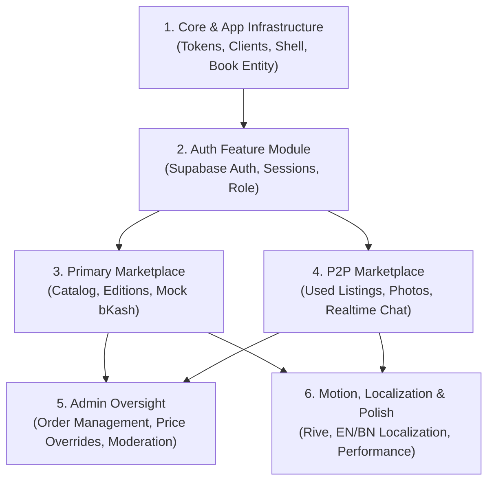

# Waraqah Implementation Plan

This implementation plan is derived directly from [PRD.md](file:///home/arifin/StudioProjects/waraqah/PRD.md) and [ARCHITECTURE.md](file:///home/arifin/StudioProjects/waraqah/ARCHITECTURE.md). It organizes work into modular steps matching the folder and module structure defined in ARCHITECTURE.md.

---

## Structure Overview & Dependencies

---

## Module Breakdown

### 1. Core & App Infrastructure (`core/`, `app/`)
- **Config & Secrets:**
  - Setup `.env` and `.env.example` with `SUPABASE_URL`, `SUPABASE_ANON_KEY`, `GO_API_BASE_URL`.
  - Ensure `.env` is explicitly ignored in `.gitignore`.
- **Design Tokens & Theme:**
  - Implement token system in `lib/core/theme/` (`app_colors.dart`, `app_typography.dart`, `app_theme.dart`) using `open_ui_kit` / shadcn tokens.
  - Configure adaptive visual effects budget (no `BackdropFilter` or blur on scrollable lists).
- **Network Clients:**
  - Setup `supabase_client.dart` with `supabase_flutter`.
  - Setup `dio_client.dart` with authentication interceptor attaching the Supabase JWT.
- **Shared Domain & Primitives:**
  - Implement canonical `Book` and `UserProfile` domain entities.
  - Implement base widgets in `lib/core/widgets/` (`AppButton`, `AppTextField`, `EmptyStateView`).
- **Routing & Shell:**
  - Configure declarative navigation in `lib/app/router/app_router.dart` with bottom navigation shell.

### 2. Authentication Feature Module (`features/auth/`)
- **Domain Layer:**
  - Define `UserSession` entity and `AuthRepository` interface (sign up, sign in, sign out, current user stream).
- **Data Layer:**
  - Implement `AuthRemoteDatasource` wrapping Supabase Auth.
  - Implement `UserDto` with JSON serialization.
  - Implement `AuthRepositoryImpl` with mapped domain failures.
- **Presentation Layer:**
  - Create `AuthController` (Riverpod `AsyncNotifier`).
  - Build `LoginPage` and `RegisterPage` with form validation.
  - Route guard enforcement in GoRouter for authenticated routes.
- **Testing:**
  - Unit tests for `AuthRepositoryImpl` and `AuthController`.

### 3. Primary Marketplace Feature Module (`features/primary_marketplace/`)
- **Domain Layer:**
  - Define `PrimaryListing`, `Order`, `OrderItem` entities.
  - Define `CatalogRepository` and `CheckoutRepository` interfaces.
- **Data Layer:**
  - Implement `CatalogRemoteDatasource` fetching Google Books synced catalog with format/edition variants and mock pricing fallback (`price_source = 'mock'`).
  - Implement `CheckoutRemoteDatasource` sending simulated bKash transaction requests to Go API.
  - Implement `CatalogRepositoryImpl` and `CheckoutRepositoryImpl`.
- **Presentation Layer:**
  - Create `CatalogController` with sorting (cheapest $\rightarrow$ most expensive, rating tie-break).
  - Create `BookDetailController` managing edition/format selection, aggregate ratings, and Google preview links.
  - Create `CheckoutController` managing simulated bKash payment form (masked phone number, ephemeral PIN handling).
  - Build `CatalogPage`, `BookDetailPage`, `CheckoutPage`, and `OrderSuccessPage`.
- **Testing:**
  - Unit tests for catalog sorting and checkout flow.
  - Widget tests for `BookCard` and edition selector.

### 4. P2P Marketplace Feature Module (`features/p2p_marketplace/`)
- **Domain Layer:**
  - Define `P2pListing`, `Conversation`, `ChatMessage` entities.
  - Define `P2pListingRepository` and `P2pChatRepository` interfaces.
- **Data Layer:**
  - Implement `P2pRemoteDatasource` for PostgREST listing CRUD and Supabase Storage photo uploads.
  - Implement `P2pRealtimeDatasource` for Supabase Realtime channel messaging.
  - Implement `P2pListingRepositoryImpl` and `P2pChatRepositoryImpl`.
- **Presentation Layer:**
  - Create `P2pFeedController` and `CreateListingController`.
  - Create `ChatController` subscribing to realtime message streams.
  - Build `P2pFeedPage` and `P2pDetailPage`.
  - Build `CreateP2pListingPage` with image picker and condition selection.
  - Build `ConversationsListPage` and `ChatPage`.
  - Implement manual seller status toggle (`available` $\rightarrow$ `sold`).
- **Testing:**
  - Unit tests for listing submission and chat repository.
  - Widget tests for `P2pListingCard` and `ChatBubble`.

### 5. Admin Oversight Feature Module (`features/admin/`)
- **Domain Layer:**
  - Define `AdminRepository` interface (order overview, price override, listing moderation).
- **Data Layer:**
  - Implement `AdminRemoteDatasource` communicating with Go API admin endpoints.
  - Implement `AdminRepositoryImpl` with role check validation (`role = 'admin'`).
- **Presentation Layer:**
  - Create `AdminController`.
  - Build `AdminDashboardPage`, `AdminOrdersPage`, and `AdminModerationPage`.
  - Restrict access in GoRouter to verified admin accounts.
- **Testing:**
  - Unit tests verifying access rejection for non-admin users.

### 6. Cross-Cutting Polish, Motion & Localization
- **Rive Integration:**
  - Implement state-machine driven buttons (tap $\rightarrow$ loading $\rightarrow$ success).
  - Implement page mask-expansion transitions with graceful fallback to standard transitions.
- **Localization:**
  - Configure `intl` with English (`en`) and Bangla (`bn`) ARB dictionaries.
  - Localize all user-facing strings and currency formatting (BDT / ৳).
- **Performance & Quality Assurance:**
  - Validate 60fps scrolling on list views.
  - Run `dart format .` and `dart analyze` across the entire workspace.

---

## Step-by-Step Execution Checklist

Work through this checklist one item at a time following the task execution workflow in AGENTS.md.

### Phase 1: Core Foundation & Infrastructure
- [x] **1.1** Setup environment configurations (`.env.example`, `.env`, `.gitignore` verification).
- [x] **1.2** Define design system tokens (`core/theme/`) following `open_ui_kit` / shadcn style with zero blur on lists.
- [x] **1.3** Implement `core/network/` clients (`SupabaseClientWrapper` & `DioClient` with auth interceptor).
- [x] **1.4** Implement canonical domain entities in `core/domain/entities/` (`Book`, `UserProfile`).
- [x] **1.5** Implement core base UI primitives in `core/widgets/` (`AppButton`, `AppTextField`, `EmptyStateView`).
- [x] **1.6** Configure app shell and declarative navigation in `app/router/app_router.dart`.

### Phase 2: Authentication Feature Module
- [x] **2.1** Define Auth domain entities (`UserSession`) and `AuthRepository` interface.
- [x] **2.2** Implement `AuthRemoteDatasource` (Supabase Auth) and `AuthRepositoryImpl`.
- [x] **2.3** Implement `AuthController` (Riverpod `AsyncNotifier`).
- [x] **2.4** Build `LoginPage` and `RegisterPage` with form validation.
- [x] **2.5** Configure GoRouter auth guards and test auth state switching.

### Phase 3: Primary Marketplace Feature Module
- [x] **3.1** Define Primary Marketplace domain entities (`PrimaryListing`, `Order`, `OrderItem`) and repository interfaces.
- [x] **3.2** Implement `CatalogRemoteDatasource` with format/edition pricing variants and mock price fallback.
- [x] **3.3** Implement `CatalogRepositoryImpl` with cheapest-first sort and rating tie-break.
- [x] **3.4** Implement `CatalogController` and `BookDetailController`.
- [ ] **3.5** Build `CatalogPage` and `BookDetailPage` (editions selector, preview link, aggregate ratings).
- [ ] **3.6** Implement `CheckoutRemoteDatasource` & `CheckoutRepositoryImpl` for simulated bKash payment.
- [ ] **3.7** Build `CheckoutPage` (masked number, ephemeral PIN, simulation disclaimer) and `OrderSuccessPage`.

### Phase 4: P2P Marketplace Feature Module
- [ ] **4.1** Define P2P domain entities (`P2pListing`, `Conversation`, `ChatMessage`) and repository interfaces.
- [ ] **4.2** Implement `P2pRemoteDatasource` (listing CRUD, Supabase Storage for photos) and `P2pListingRepositoryImpl`.
- [ ] **4.3** Implement `P2pRealtimeDatasource` (Supabase Realtime messaging) and `P2pChatRepositoryImpl`.
- [ ] **4.4** Implement `P2pFeedController` and build `P2pFeedPage` & `P2pDetailPage`.
- [ ] **4.5** Implement `CreateListingController` and build `CreateP2pListingPage` with image upload & condition selector.
- [ ] **4.6** Implement `ChatController` and build `ConversationsListPage` & `ChatPage`.
- [ ] **4.7** Implement seller manual status toggle (`available` $\rightarrow$ `sold`).

### Phase 5: Admin Oversight Feature Module
- [ ] **5.1** Define `AdminRepository` interface and implement `AdminRemoteDatasource` (Go API).
- [ ] **5.2** Implement `AdminController` with admin role enforcement.
- [ ] **5.3** Build `AdminDashboardPage`, `AdminOrdersPage`, and `AdminModerationPage`.

### Phase 6: Motion, Localization & Final Verification
- [ ] **6.1** Integrate Rive state machines for action buttons and page transitions with graceful degradation.
- [ ] **6.2** Setup English (`en`) and Bangla (`bn`) localization dictionaries and number/currency formatting.
- [ ] **6.3** Execute full test suite (`flutter test`), `dart format .`, and `dart analyze` ensuring zero warnings/errors.

