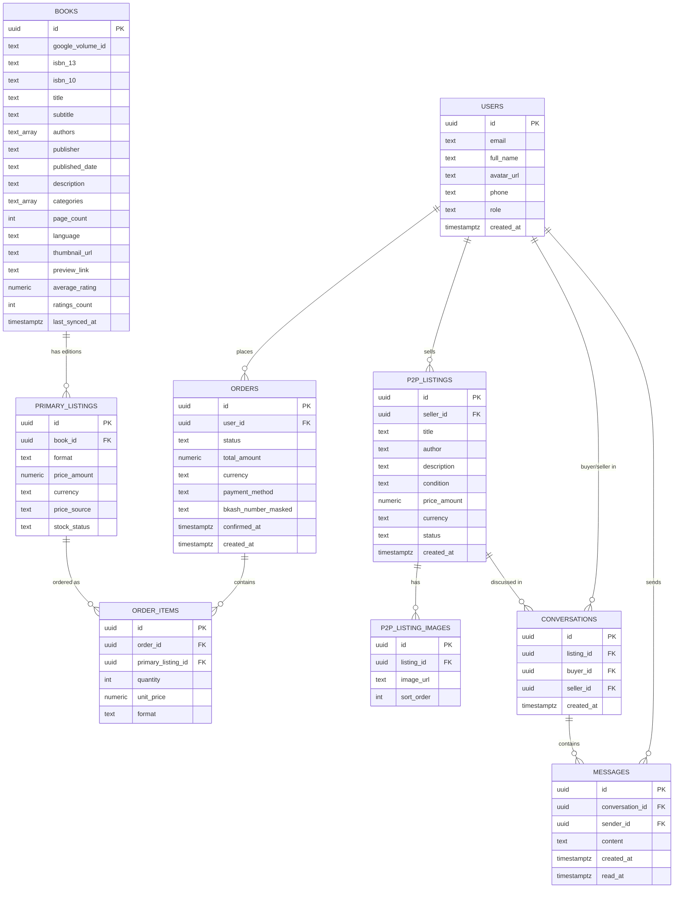

# Waraqah — Product Requirements Document (v1)

**Document type:** PRD
**Status:** Draft — v1 scope locked
**Audience:** Human developers + AI coding assistants implementing this project
**Project type:** University project (no real payment processing, no production data pipelines)

---

## 0. How to read this document

Requirements are tagged with stable IDs (`REQ-x.y.z`) so they can be referenced in code comments, commit messages, tickets, or prompts to an AI coding assistant without ambiguity. Anything marked **[FUTURE]** is explicitly out of scope for this build and exists only to inform architecture decisions (so v1 doesn't have to be reworked later).

---

## 1. Product Summary

Waraqah is a book buy/sell platform with two core transaction flows:

1. **Primary Marketplace** — buy new books (physical or ebook), sourced from Google Books API metadata.
2. **P2P Marketplace** — peer-to-peer resale of used books, Facebook-Marketplace-style (list, message, manually mark sold).

**v1 scope is strictly limited to these two flows.** Everything else (social feed, AI assistant) is deferred and documented only so the architecture doesn't block adding them later.

### 1.1 In scope for v1
- REQ-SCOPE-1: Primary Marketplace (new books)
- REQ-SCOPE-2: P2P Marketplace (used books)
- REQ-SCOPE-3: User authentication (regular users + admin role)

### 1.2 Explicitly out of scope for v1 — **[FUTURE]**
- **[FUTURE]** Book-Bites microblogging/social feed
- **[FUTURE]** AI Recommendation Assistant (Gemini API)

These are not classified as "phase 2 tickets" — they are vision items. Only the architecture needs to accommodate them; no functional work should target them yet.

---

## 2. Users & Roles

There is no separate "student" classification. All accounts are plain users; the only role distinction is:

| Role | REQ ID | Description |
|---|---|---|
| `user` | REQ-2.1 | Default role. Can buy in Primary Marketplace, create/browse/message in P2P Marketplace. |
| `admin` | REQ-2.2 | Elevated role for catalog/order oversight (see §5.3). No separate login system — same Supabase Auth, differentiated by a `role` column. |

**REQ-2.3 — Admin credential policy:** Admin accounts are **never hardcoded** in source code or client bundles. The admin account is created through the same Supabase Auth signup mechanism as any user, then promoted by setting `role = 'admin'` directly in the database (via a seed script or Supabase dashboard) — never in a committed file. Any seed script that creates a default admin must read the email/password from environment variables that are `.gitignore`'d, not literals in the script.

---

## 3. Functional Requirements

### 3.1 Primary Marketplace (New Books)

| REQ ID | Requirement |
|---|---|
| REQ-3.1.1 | Users can browse and purchase books in **physical** and **ebook** format. |
| REQ-3.1.2 | Book catalog data (title, authors, description, cover image, ISBN, categories, page count, language) is sourced from the **Google Books API** — no web scraping. |
| REQ-3.1.3 | Price comparison is shown **across editions of the same title** (e.g. different publishers/formats), not across multiple third-party retailers — Google Books does not expose third-party retailer pricing. |
| REQ-3.1.4 | Pricing per edition comes from Google Books `saleInfo.retailPrice` **when `saleability = FOR_SALE`**; when unavailable (common — most volumes are `NOT_FOR_SALE`), a platform-seeded **mock price** is used instead, flagged internally via `price_source`. |
| REQ-3.1.5 | Search/browse results default-sort **cheapest → most expensive**. |
| REQ-3.1.6 | Ties in price are broken by **`averageRating` descending**. |
| REQ-3.1.7 | Book detail view surfaces: description, cover image, `averageRating`, `ratingsCount`, and a `previewLink` to Google's preview widget. **No review text is available or shown** — Google Books API exposes only aggregate rating data, not written reviews. |
| REQ-3.1.8 | Checkout uses a **simulated bKash flow only**: user enters a bKash number → enters a PIN/password field → confirms. No real payment gateway, sandbox, or money movement is integrated. This must be clearly non-production by design. |

### 3.2 P2P Marketplace (Used Books)

Modeled on Facebook Marketplace: listing + direct messaging, no in-app checkout.

| REQ ID | Requirement |
|---|---|
| REQ-3.2.1 | Any user can create a listing: title, author, description, condition (`new` / `like_new` / `good` / `fair` / `poor`), price, and photos. |
| REQ-3.2.2 | Listings are browsable/searchable independently of the Primary Marketplace catalog — this is a fully separate data model, not linked to `books`. |
| REQ-3.2.3 | A prospective buyer can open a **direct message thread** with the listing's seller from the listing page. |
| REQ-3.2.4 | There is **no automated sale detection or in-app payment**. The seller manually updates listing status (`available` → `sold`) once a sale happens off-platform. |
| REQ-3.2.5 | Messaging should use Supabase Realtime (see §5.2) rather than polling, since it's provided essentially for free by the stack already in use. |

### 3.3 Deferred Features — **[FUTURE]**, documented for architecture only

| Feature | Note |
|---|---|
| Book-Bites (microblogging, inline book tagging) | Will consume the shared `core` Book model to link posts to catalog books — must not require Primary/P2P modules to depend on it. |
| AI Recommendation Assistant (Gemini API) | Will be its own Lego module; consumes `core` Book model for recommendations grounded in the existing catalog. |

---

## 4. Frontend Architecture — Flutter / Dart

**Pattern: "Lego on the outside, Clean Architecture on the inside."**

- **Lego (feature-first, outer layer):** Each major feature is an independent, self-contained Dart package. Feature packages **do not depend on each other directly.**
- **Clean Architecture (inner layer):** Within each feature package: `domain/` (entities, use cases, repository interfaces), `data/` (repository implementations, data sources — Supabase client calls, Dio calls to the Go API), `presentation/` (widgets, state).
- **`core/` package:** Shared, feature-agnostic code — the canonical `Book` entity, shared interfaces, shared UI primitives/theme, network client setup. This is the **only** thing other feature packages are allowed to depend on. This is what lets `[FUTURE]` features like Book-Bites reference books without creating a dependency between Primary Marketplace and Social Feed.

```
waraqah/
├── core/                        # shared across all features
│   ├── domain/                  # Book entity, shared interfaces
│   ├── data/                    # Supabase client, Dio client setup
│   └── presentation/            # theme, shared widgets
├── features/
│   ├── primary_marketplace/     # Lego piece — v1
│   │   ├── domain/
│   │   ├── data/
│   │   └── presentation/
│   ├── p2p_marketplace/         # Lego piece — v1
│   │   ├── domain/
│   │   ├── data/
│   │   └── presentation/
│   ├── social_feed/             # [FUTURE] Lego piece — not built yet
│   └── ai_assistant/            # [FUTURE] Lego piece — not built yet
└── app/                         # app shell, routing, DI wiring
```

### 4.1 Key packages
| Package | Purpose |
|---|---|
| `go_router` | Declarative routing |
| Shell routes (via `go_router`) | Persistent nav shell (bottom nav, etc.) across nested routes |
| `flutter_riverpod` | State management |
| `dio` | HTTP client — used specifically for calls to the **Go API layer** (see §5.1); Supabase calls go through the Supabase SDK directly, not Dio |
| `intl` / `flutter_localizations` | Localization (English + Bangla, given BD market focus) |
| `freezed` + `json_serializable` | Immutable models + JSON codegen for the shared `Book` entity and DTOs |
| `rive` | State-machine-driven UI components and page transitions (see §4.2) |

### 4.2 Motion (Rive)
- **REQ-4.2.1:** Interactive components (e.g. "Add to Cart") are Rive state machines, not static widgets — tap → loading → success states driven by real backend responses.
- **REQ-4.2.2:** Page transitions (e.g. book cover → detail page) use Rive mask-expansion transitions instead of default slide transitions.
- Target Material 3 as a base aesthetic, customized to avoid a generic/default look.

### 4.3 UI Theme / Design System Decision

**REQ-4.3.1 — Priority order:** Smoothness first, stylistic flair second. Any theming choice that risks frame drops on mid/low-end Android hardware (the realistic target device profile for this market) is rejected regardless of how it looks.

**Decision: `open_ui_kit` as the base design system**, not a glassmorphism/"futuristic" kit.

Rationale:
- **Heavy glassmorphism kits were considered and rejected.** Packages like `flare_ui` and similar `BackdropFilter`-based glass kits market a "futuristic Fintech" look, but `BackdropFilter` forces GPU blur compositing on every frame it's visible — a well-known jank source on scrolling lists with multiple glass cards, directly conflicting with REQ-4.3.1. They're also largely unproven (e.g. `flare_ui` has effectively no real adoption and an unverified publisher), a real risk for a graded deliverable.
- **`open_ui_kit`** is token-driven and shadcn-inspired — clean, high-contrast, composable — and is explicitly built with the smoothness/accessibility tradeoff in mind: it ships **adaptive visual-effects budgets that reduce or fully exclude blur effects on Android by default** (with compile-time `BackdropFilter` exclusion available), rather than defaulting to heavy glass everywhere.
- **Avoids competing with Rive for frame budget.** Rive (§4.2) is already the app's dedicated "futuristic" signal — a second GPU-heavy visual effects system (glass blur) running alongside it would split frame budget between two effects systems instead of spending it on the one that's actually spec'd for high-impact moments.

**REQ-4.3.2 — Where limited glass/blur accents are still acceptable:** Sparingly, on static, non-scrolling surfaces only — e.g. a single hero/landing screen element — never on scrollable lists (book grids, P2P listing feeds, order history, message threads), where the cost compounds with every frame of scroll.

**REQ-4.3.3 — Division of labor:** `open_ui_kit` supplies the base component/token layer (buttons, inputs, cards, typography, color system) app-wide. Rive is reserved for the specific high-impact interactions already defined in §4.2 (state-driven buttons, page transitions) rather than spread across every component.

---

## 5. Backend Architecture — Go + Supabase

**Decision:** Supabase is not a full replacement for the Go layer, nor purely a hosted database. It's split by responsibility:

| Responsibility | Owner | Why |
|---|---|---|
| Postgres hosting | **Supabase** | No need to self-host/manage Postgres |
| Auth (signup/login/session) | **Supabase Auth** | Built-in, avoids hand-rolled auth in Go |
| File storage (listing photos, avatars) | **Supabase Storage** | Built-in buckets |
| P2P realtime messaging | **Supabase Realtime** | Purpose-built for this, avoids hand-rolled websockets |
| Simple CRUD (browsing listings/books) | **Supabase client (direct from Flutter)** via PostgREST + Row Level Security | No need to proxy trivial reads through Go |
| Google Books API integration & caching into `books`/`primary_listings` | **Go API** | Business logic: normalizing Google's response, applying mock-price fallback, cache refresh |
| Price sort + rating tie-break logic | **Go API** | Custom logic beyond what RLS/PostgREST can express cleanly |
| Mock bKash order/payment flow | **Go API** | Transactional logic (order creation, status transitions) |
| Admin operations (§5.3) | **Go API** | Privileged actions, kept off the direct-client path |

**REQ-5.1 — Client rule:** Flutter talks to **Supabase directly** (via `supabase_flutter`) for auth, storage, realtime messaging, and simple reads. Flutter talks to the **Go API** (via Dio) only for the specific business-logic operations listed above.

### 5.2 Realtime (P2P Messaging)
Conversations and messages are Supabase Realtime tables. New messages subscribe over Supabase's realtime channel — no custom websocket work needed.

### 5.3 Admin capabilities (v1 minimum)
- REQ-5.3.1: View/manage all orders (Primary Marketplace).
- REQ-5.3.2: Override/correct mock prices on `primary_listings` where Google Books has no sale data.
- REQ-5.3.3: Remove/moderate inappropriate P2P listings.

Admin endpoints live behind the Go API, gated by checking `role = 'admin'` on the authenticated Supabase user — never a separate credential system (see REQ-2.3).

---

## 6. Database Schema (PostgreSQL, hosted on Supabase)



### 6.1 Table notes

**`users`**
Mirrors `auth.users` (Supabase-managed) with a 1:1 profile row. `role` is `'user'` or `'admin'`, defaulting to `'user'`. This is the only role distinction in the system — see REQ-2.3 on why admin is never hardcoded.

**`books`**
A local cache of Google Books API results, keyed by `google_volume_id` (unique). This is what makes entity resolution trivial compared to the original scraping plan — Google already provides a canonical ID per edition, so no fuzzy-matching is needed. Refreshed periodically via `last_synced_at`.

**`primary_listings`**
Represents a **purchasable edition/format** of a book — this is where price comparison (REQ-3.1.3–3.1.6) actually happens, since one `book` can have multiple `primary_listings` (e.g. paperback vs. hardcover vs. ebook, each its own Google Books volume or format variant). `price_source` is `'google'` or `'mock'` per REQ-3.1.4.

**`orders` / `order_items`**
Standard order model. `bkash_number_masked` stores only a masked/partial number for display — **the PIN entered during the mock checkout flow must never be persisted**, since it's a simulated auth step, not a real credential.

**`p2p_listings` / `p2p_listing_images`**
Deliberately **not** foreign-keyed to `books` — per REQ-3.2.2, this marketplace is independent of the primary catalog (user-submitted title/author as free text, not matched against Google Books).

**`conversations` / `messages`**
Backs the P2P messaging flow (REQ-3.2.3). One conversation per (listing, buyer) pair. Powered by Supabase Realtime subscriptions on `messages`.

### 6.2 Row Level Security (high-level intent)
- Users can only read/write their own `orders`, `conversations` they're party to, and `messages` within those conversations.
- Any authenticated user can read `books` and `primary_listings` (public catalog).
- Only the listing's `seller_id` can update their own `p2p_listings` (e.g. flip status to `sold`).
- `role = 'admin'` bypasses relevant restrictions for moderation — enforced primarily through the Go API layer, not raw client-side RLS bypass, to keep privileged logic auditable.

---

## 7. Non-Functional Notes

- **REQ-7.1:** All payment functionality is explicitly simulated. This must be documented in-app (e.g. a small disclaimer on the checkout screen) so it's never mistaken for a production payment integration.
- **REQ-7.2:** Localization support (English + Bangla) is required given the BD-market data source (Google Books results relevant to BD users, currency display).
- **REQ-7.3:** Rive animations should degrade gracefully — a missing/failed Rive asset should not block core purchase or listing flows.

---

## 8. Known Risks / Open Items

| Risk | Detail |
|---|---|
| Google Books pricing coverage | Most volumes return `saleability: NOT_FOR_SALE`; mock pricing fallback (REQ-3.1.4) is required for the catalog to stay usable, not an edge case. |
| No review text | Google Books API only exposes rating aggregates, not review content — product copy/UI should say "Ratings," not "Reviews," to avoid overpromising. |
| Supabase RLS vs. Go business logic split | Needs care to avoid duplicate/conflicting logic between what RLS allows directly and what the Go API enforces — document ownership per table clearly during implementation. |

---

## 9. Roadmap (Post-v1) — **[FUTURE]**, not built now
1. Book-Bites social feed, using `core` Book model for inline tagging.
2. AI Recommendation Assistant via Gemini API, grounded in existing catalog data.

Both are designed for **only** at the architecture level (Lego module boundaries, `core/` package) so v1 work doesn't need rework to accommodate them later.
